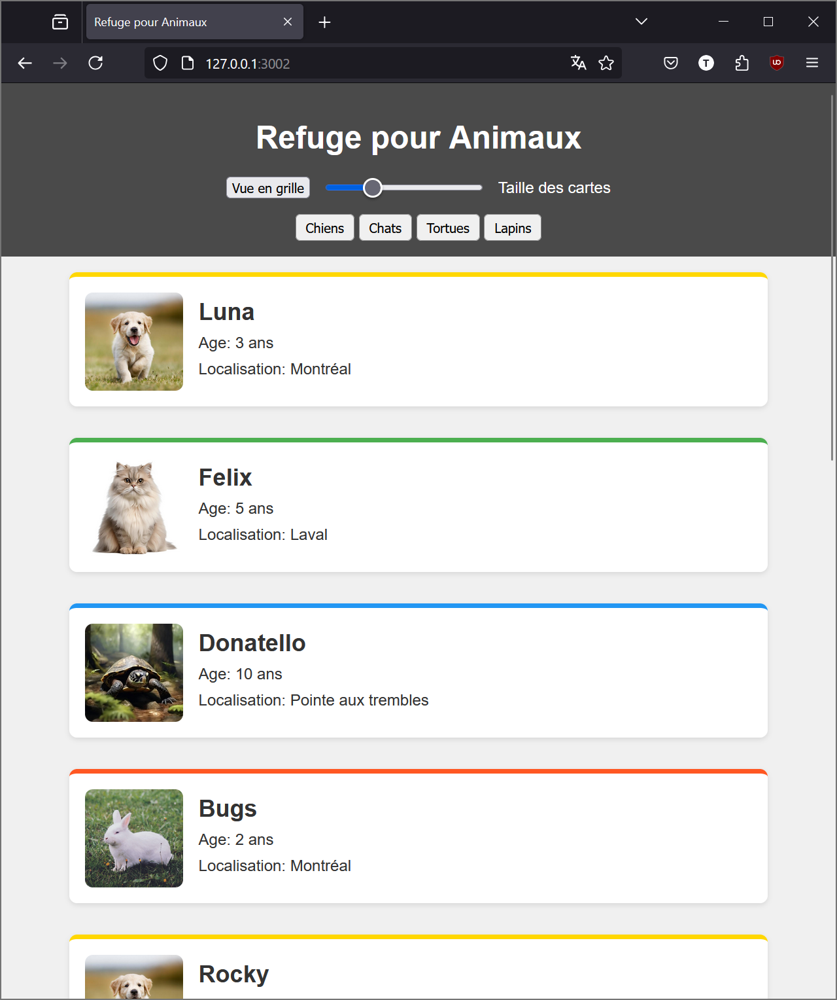
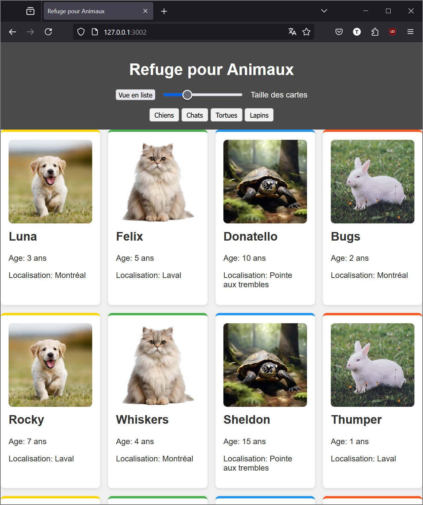
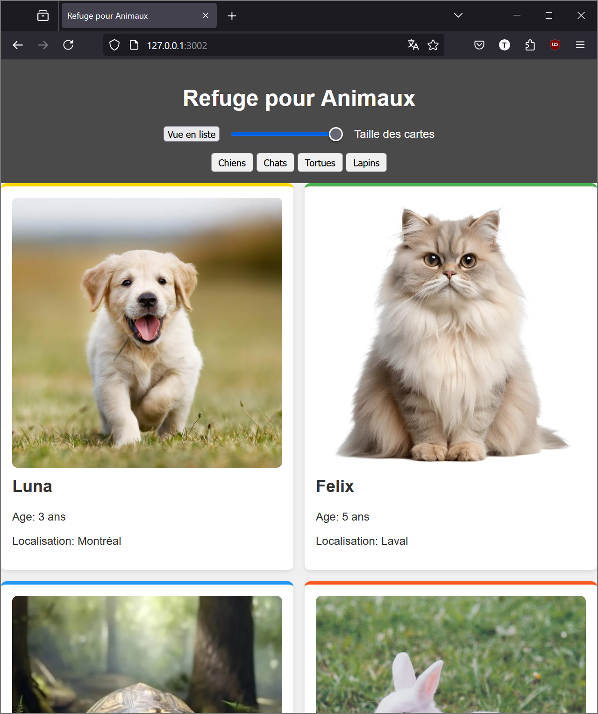
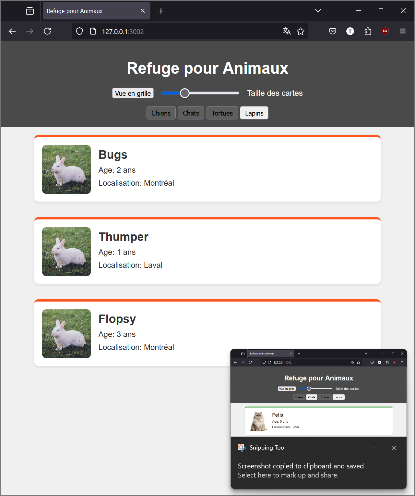
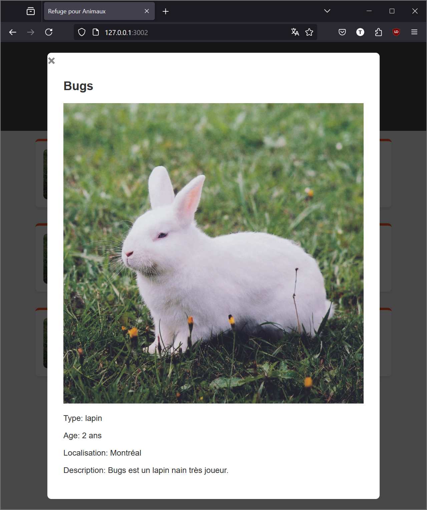

[](https://classroom.github.com/a/UIe6FVRa)
# Laboratoire : Création d'une page web pour un refuge d'animaux

## Objectif
Créer une page web interactive pour un refuge d'animaux, permettant aux utilisateurs de visualiser et filtrer les animaux disponibles pour l'adoption.

## Matériel fourni
- Un fichier HTML de base (index.html)
- Un fichier CSS de base (styles.css)
- Un fichier JavaScript de base (script.js)
- Un fichier JSON contenant les données des animaux (animaux.json)

### Chargement des données JSON
La liste des animaux est définie dans le fichier `animaux.json` présent à la racine du dépôt. Lors du chargement de la page, le contenu de `script.js` est executé et va aller chercher le contenu de ce fichier avec `fetch('animaux.json')` et stocke le résultat dans la variable globale `animaux`. La fonction `renderAnimals` est ensuite appelée et va créer un composant `div` à l'intérieur de l'élément avec l'id `animal-container`.
 Le chargement de la liste est fourni et n'a pas besoin d'être modifié pour réaliser le travail demandé.

### Images d'animaux
Les photos des animaux sont contenues dans le dossier `assets` et leur nom correspond à la catégorie d'animal trouvée dans le fichier JSON, le code suivant permet de faire en sorte que le nom de l'image chargée soit le nom du type d'animal suivi de `.jpg`:

```html
        
```

## Tâches à réaliser

### 1. Mise en page de la carte d'animal

#### 1.a Contenu de la carte

Dans la liste, la carte d'animal devrait montrer le nom, l'âge, la localisation et la photo. **La description ne devrait pas apparaître**.
Le contenu de la carte pourra être mis en place avec flex.
Les photos d'animaux devraient toutes êtres affichées avec la même taille.
En mode liste, l'image est à gauche et le texte en colonne à droite. En mode grille, l'image est en haut et le texte en colonne en dessous.

#### 1.b Décoration de la carte
Suivant l'animal de la carte, un élément de stylisation devrait être appliqué permettant d'identifier visuellement la *classe* d'animal

### 2. Affichage en liste ou grille

 #### 2.a Affichage sous forme de grille ou liste 
   Le changement de mode devrait se faire uniquement à travers l'ajout/retrait/toggle de classes CSS à l'aide de la fonction javascript appellée lors du clic sur le bouton. 
   Le style d'affichage en liste pourra être fait en utilisant flexbox, l'affichage en grille pourra être fait avec grid. 

*Affichage en liste*


*Affichage en grille*



#### 2.b Taille des éléments en grille dynamique
   Lors de l'affichage en mode grille, modifier la valeur du slider devrait augmenter/réduire la taille des éléments de la grille. Le slider n'a aucun effet sur la taille des objets en mode liste.

*Grille de carte plus grande*

 

### 3. Filtrage par type d'animal

#### 3.a Choisir quels animaux sont affichés
   Les 4 boutons disponible en haut de la liste des animaux servent à afficher ou non une catégorie d'animal. Lorsque le bouton est actif, l'animal filtré devrait être visible. Lorsque le bouton est inactif, l'animal filtré ne devrait pas être visible. Lorsque tous les boutons sont inactifs, il devrait y avoir aucun animal affiché. 


#### 3.b Mettre en évidence visuellement le bouton actif.
   Le style du bouton devrait changer entre actif et inactif afin de permettre à l'utilisateur de comprendre rapidement ce qui se passe devant lui.

*Un seul filtre actif*

#### 4. Affichage modal des détails

#### 4.a Affichage du modal au clic sur un animal
   Lors du clic sur un animal, une fenêtre modale devrait apparaitre au dessus du reste du contenu de la page permettant de visualiser la description de l'animal et de voir la photo en plus gros. 

#### 4.b Fermeture du modal
   Le modal devrait montrer un bouton (en forme de croix par exemple) permettant de le former. Un clic en dehors de la fenêtre du modal devrait la fermer également.

*Modal*

*Un seul filtre actif*


### 4. Gestion des images (Bonus)
   - Ajouter une image unique pour chaque animal.
   - Afficher ces images dans les cartes des animaux et dans le modal de détails.

## Conseils
- Utilisez JavaScript pour manipuler le DOM et gérer les interactions utilisateur.
- Assurez-vous que votre code est bien structuré et commenté.
- Testez votre page sur différents navigateurs et tailles d'écran pour garantir l'adaptivité.
- Le code n'a pas besoin d'être modifié pour mener à bien le travail.

## Critères d'évaluation
- Fonctionnalité : Toutes les fonctionnalités demandées sont implémentées et fonctionnent correctement.
- Design : L'interface est propre, intuitive et responsive.
- Code : Le code est bien organisé, lisible et suit les bonnes pratiques de développement web.
- Bonus : Implémentation réussie de la gestion des images pour chaque animal.

Bonne chance !