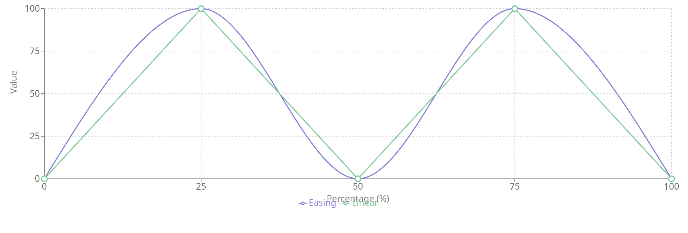
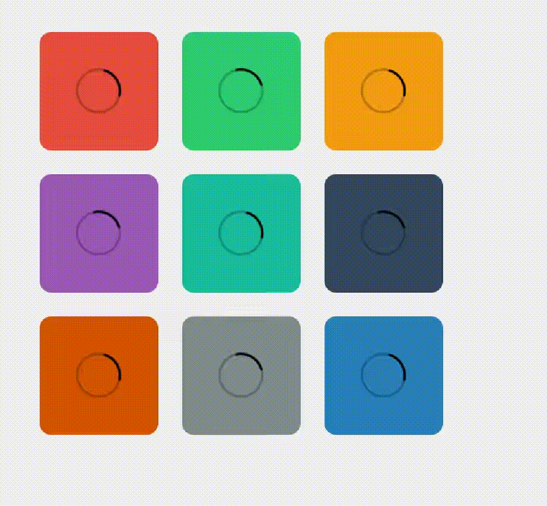

[](https://classroom.github.com/a/k_40nD2R)
# Séance 9: Les animations en CSS


## Introduction 

 Une animation en CSS permet de modifier progressivement le style d'un élément sur une période donnée. Contrairement aux transitions, qui ne réagissent qu'à un changement d'état, les animations peuvent être déclenchées et exécutées de manière continue, sur plusieurs étapes.

### Fondamentaux de l'Animation

Les 12 principes fondamentaux de l'anmimation ont été théorisés par par Ollie Johnston et Frank Thomas dans le livre *The illusion of life*.

Ces concepts bien que définies pour l'animation plus classique à la main sont en grande partie applicables aux animatinos réalisées en CSS ou avec tout autre système d'animation. 

 Une explication en détail est faite ici [Application des 12 principes au CSS](
 https://openclassrooms.com/fr/courses/5919246-creez-des-animations-css-modernes/6340915-appliquez-les-12-principes-de-l-animation-au-web)

## Syntaxe

### Les images clés (keyframes)

 C'est la directive qui définit l'animation en spécifiant les styles à différents moments (ou étapes) dans le temps. Le navigateur va interpoler les valeurs entre deux images clé pour faire progresser la valeur de manière fluide à l'aide de la fonction de temporisation.

Ici, `from` représente l'état initial et `to` l'état final, avec l'élément qui se déplace de gauche à droite.
```css
@keyframes slide-in {
    from {
    transform: translateX(-100%);
    }
    to {
    transform: translateX(0%);
    }
}
```

Chaque ensemble `@keyframes` doit avoir un nom afin d'être appliqué à un élément. C'est comme une variable globale qui contient les informations de progression de notre animation.


### Les propriétés liées aux animations

   - **animation-name :** Le nom de l'animation à utiliser (doit correspondre à celui défini dans `@keyframes`).
   - **animation-duration :** Définit la durée de l'animation (ex. `1000ms` ou `1s` pour une seconde).
   - **animation-timing-function :** Détermine la manière dont l'animation progresse dans le temps (ex. `linear`, `ease`, `ease-in-out`). Elle définit la vitesse à laquelle l'animation avance entre les étapes.
   - **animation-iteration-count :** Spécifie combien de fois l'animation doit être jouée (un nombre entier ou `infinite` pour une répétition infinie).


Ici, l'élément avec la classe `.box` va se déplacer de gauche à droite en 1 seconde, avec un effet d'accélération et de décélération (`ease-out`). 
```css
.square1 {
    animation-name: slide-in;
    animation-duration: 1s;
    animation-timing-function: ease-out;
}
```

Donner un nom à l'animation permet de la réutiliser pour d'autres composants en modifiant son execution:

```css
.square1 {
    animation-name: slide-in;
    animation-duration: 1000ms;
    animation-timing-function: ease-out;
}
.square4 {
    animation-name: slide-in;
    animation-duration: 2s;
    animation-timing-function: ease-in;
}

```

 Ces propriétés peuvent être combinées comme avec les transitions en utilisant la propriété `animation`:

```css
.square4 {
    animation: slide-in 2s ease-in;
}
```

### Combiner plusieurs propriétés dans une seule animation :**

Une animation peut modifier plusieurs propriétés CSS simultanément, comme l’opacité et la position. 

Ici, l'élément `.box` apparaîtra en glissant vers le bas tout en tournant légèrement et en passant d’une opacité de 0 à 1.
```css
@keyframes drop-in {
from {
    transform: translateY(-100%) rotate(-30deg);
    opacity: 0;
}
to {
    transform: translateY(0%) rotate(0deg);
    opacity: 1;
}
}

.square2 {
animation: drop-in 1000ms ease-out;
}
```


### Fonctions de temporisation (Timing Functions)

Ces fonctions contrôlent la vitesse à laquelle une animation progresse d'une étape à une autre. Les plus courantes sont :
- **linear :** Le changement de style se fait à vitesse constante.
- **ease :** L'animation démarre lentement, accélère, puis ralentit avant la fin (par défaut).
- **ease-in :** Démarre lentement, puis accélère.
- **ease-out :** Démarre rapidement, puis ralentit à la fin.
- **ease-in-out :** Démarre lentement, accélère au milieu, puis ralentit à la fin.

## Boucles d'animation

### Répétitions
 Le nombre de fois que l'animation est répétée est contrôlé par la propriété  **`animation-iteration-count`**
     - **Nombre entier** (ex. `3` pour 3 répétitions).
     - **`infinite`** pour répéter l'animation indéfiniment.
   
### Direction de l'animation

Il est possible de choisir dans quelle direction l'animation va être jouée en utilisant la propriété **`animation-direction`**
     - **`normal`** (par défaut) : L'animation va de 0% à 100%.
     - **`reverse`** : L'animation se joue à l'envers, de 100% à 0%.
     - **`alternate`** : L'animation alterne entre 0%-100% et 100%-0% à chaque répétition.
     - **`alternate-reverse`** : Comme `alternate`, mais l'animation commence par la fin.

```css
    .box {
    animation: complex-animation 3s infinite alternate;
    }
```


## Exercice 1

- Réaliser une animation de chargement dans le 5ème carré (`square5`) en faisant tourner l'image du cercle.
- Animer la position et opacité du 8ème carré afin qu'il oscille de haut en bas, il doit être visible en haut et invisible en bas.


## Animations complexes et multi-étapes avec CSS

### Création d'animations multi-étapes avec `@keyframes`

#### Les pourcentages dans les animations

 Contrairement aux animations simples qui se composent seulement de deux étapes (`from` et `to`), les animations complexes peuvent utiliser des pourcentages pour définir des états intermédiaires.

 Chaque pourcentage représente un moment spécifique dans la progression de l'animation, la durée est spécifiée par l'élément appelant l'animation.
     
```css
@keyframes multi-step-spin {
0% {
    transform: rotate(0deg);
}
25% {
    transform: rotate(90deg);
}
50% {
    transform: rotate(180deg);
}
75% {
    transform: rotate(270deg);
}
100% {
    transform: rotate(360deg);
}
}
.spinner {
animation: multi-step-spin 2s infinite;
}
```

#### Utilisation des pourcentages

- **0%** et **100%** sont équivalents à `from` et `to`, mais les étapes intermédiaires permettent d'ajouter plus de contrôle.

- On peut appliquer différents styles à chaque étape : modifications de taille, opacité, couleurs, etc.

### Effet des fonctions de temporisation

 Lorsqu'une animation complexe est appliquée à un élément, la fonction de temporisation va être appliquée entre les keyframes et non plus sur la totalité de l'animation. Une transition, une animation avec `from` `to` ou une animation avec deux keyframes `0%` et `100%` sont équivalentes.

 ```css
 @keyframes zigzag { 
    0% { 
        transform: translateY(0)
    }
    25% { 
        transform: translateY(100%)
    }
    50% {
        transform: translateY(0%)
    }
    75% { 
        transform: translateY(100%)
    }
    100% { 
        transform: translateY(0%)
    }
 }

 .square6 { 
    animation: zigzag 5s ease-in-out;
 }
 .square7 { 
    animation: zigzag 5s linear;
 }
 ```

 

### Coordonner plusieurs propriétés dans une seule animation

Il est possible d'animer simultanément plusieurs propriétés CSS comme `opacity`, `transform`, `color`, etc.


```css
@keyframes complex-animation {
    0% {
        transform: scale(1);
        background-color: red;
        opacity: 1;
    }
    50% {
        transform: scale(1.5);
        background-color: blue;
        opacity: 0.5;
    }
    100% {
        transform: scale(1);
        background-color: red;
        opacity: 1;
    }
}

.box {
    animation: complex-animation 3s infinite;
}
```

Dans cet exemple, l'élément change de taille, de couleur et d'opacité à des étapes spécifiques de l'animation.


## Animations dynamiques

Les animations CSS peuvent être rendues encore plus puissantes et flexibles en utilisant des variables CSS (aussi appelées propriétés personnalisées). Cette approche permet de créer des animations dynamiques qui peuvent être facilement ajustées et personnalisées sans modifier la définition de base de l'animation.

```css
:root {
  --bounce-height: 20px;
}

@keyframes bounce {
  0%, 100% { transform: translateY(0); }
  50% { transform: translateY(calc(var(--bounce-height) * -1)); }
}

.ball {
  width: 50px;
  height: 50px;
  background-color: red;
  border-radius: 50%;
  animation: bounce 0.5s infinite alternate ease-in-out;
}
```

## Animation des sous composants

Il est possible d'animer des groupes d'éléments en utilisant des sélecteurs avancés. Cette méthode permet de faire varier des ensembles d'objets sur la page de manière cohérente tout en leur ajoutant quelques différences

```css
@keyframes respiration { 
    0% { 
        transform: scale(1)
    }
    100% {
        transform: scale(1.1)
    }
}

.square:nth-child(4) { 
    animation-delay: 0.5s
}

.square { 
    animation: respiration 1s ease-in-out infinite;
}
```


## Exercice 2
- Ajoutez une animation sur les images dans les carrés afin qu'elles tournent sur elle même pour créer un effet de chargement. 
- Les images dans les carré pair vont tourner dans le sens horaire, dans les carrés impaires dans le sens anti horaire
- Ajoutez une animation au survol du carré avec plusieurs étapes permettant de faire varier la taille et couleur. Sur la première moitié de l'animation le carré doit grossir lentement, sur la seconde partie de l'animation le carré doit disparaitre et grossir encore plus.




