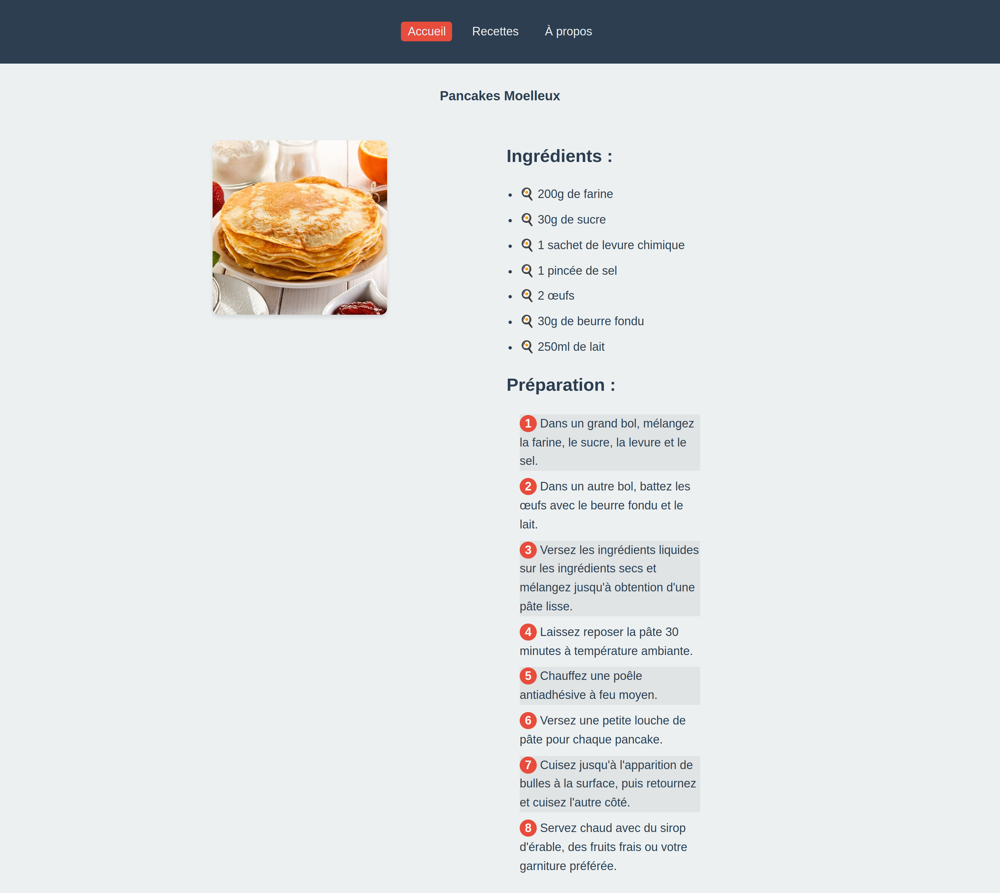
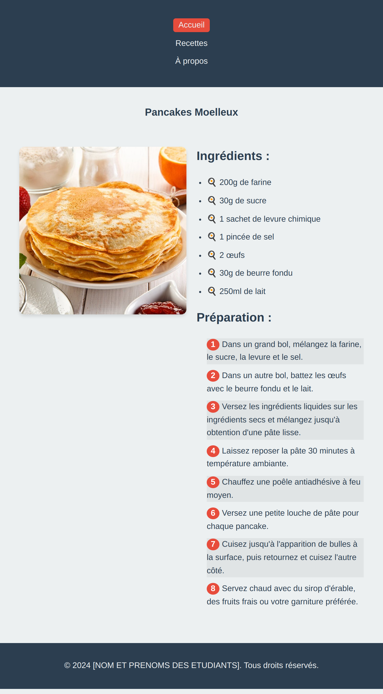

# Énoncé du Laboratoire 1 : Création d'un layout adaptatif pour une page Web de recette

### Objectif :
Appliquer les concepts de CSS pour créer un layout adaptatif d'une page Web de recette de cuisine, en utilisant les fichiers fournis (laboratoire1.index.html et laboratoire1.styles.css).

### Tâches :

1. Sélecteurs et propriétés CSS de base (6 points)
   - Utiliser correctement les sélecteurs de type, de classe et d'ID (2 points)
   - Appliquer les propriétés de mise en forme du texte (couleur, taille, police, etc.) (2 points)
   - Définir les marges, paddings et bordures appropriés (2 points)

2. Mise en place d'un layout adaptatif (6 points)
   - Utiliser le modèle de boîte CSS pour structurer le contenu (2 points)
   - Implémenter un layout adaptatif en utilisant des unités relatives (%, em, rem) (2 points)
   - Positionner correctement les éléments pour s'adapter à différentes tailles d'écran (2 points)

3. Utilisation des variables CSS et des pseudo-classes (4 points)
   - Définir et utiliser des variables CSS (custom properties) pour les couleurs et tailles (2 points)
   - Appliquer des styles différents avec les pseudo-classes (:hover, :active, etc.) (2 points)

4. Media queries pour un design adaptatif (4 points)
   - Créer des points de rupture appropriés pour adapter le layout (2 points)
   - Ajuster les tailles de police et les marges pour maintenir la lisibilité sur différents appareils (2 points)

### Critères d'évaluation :
- Respect des principes du design adaptatif
- Cohérence et lisibilité du code CSS
- Adaptation appropriée du layout aux différentes tailles d'écran sans changement radical de mise en page
- Maintien de la lisibilité et de l'utilisabilité sur une variété d'appareils

### Remise :
Soumettez les fichiers styles.css et index.htnl modifiés, ainsi qu'une brève explication (maximum 200 mots) de votre approche pour créer un layout adaptatif.

Total : 20 points

### Résultat attendu: 

#### Large:

#### Moyen:

#### Large:

