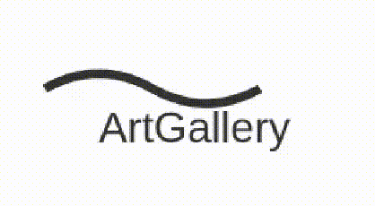

# Laboratoire: Création d'oeuvres d'art

## Organisation

Ce laboratoire peut être réalisé en équipe ou en binôme.
Le travail est à remettre avec github classroom en publiant les modifications apportées sur la branche main du dépôt créé automatiquement pour les équipes.

## Objectif

Créer une série d'oeuvre d'art en CSS en utilisant des transitions, animations et SVG.

## Matériel fourni
- Un fichier HTML de base (index.html) **Des modifications sont à apporter à ce fichier**
- Un fichier css pour les animations (animations.css) **Des modifications sont à apporter à ce fichier**
- Un fichier css de base (styles.css)
- Un fichier js de base (script.js)

## Tâches à réaliser

### 1. Affichage des informations

Lors du passage de la souris sur une carte, le titre et nom de l'artiste doivent apparaître en 0.3s.

### 2. Rotation Simple

Cette animation représente un carré en rotation avec une vitesse constante effectuée en 4s.

### 3. Pulsation 

Cette animation représente un cercle vivant avec une pulsation de 2s. L'échelle varie entre 90% et 110% suivante cette courbe: 

### 4. Rebond

Cette animation représente une balle allant de haut en bas avec un mouvement ralenti au debut et à la fin de l'animation d'une durée de 1s.

### 5. Gradient animé

Cette animation de 10s représente une plage de couleur qui se déplace sur l'écran.

### 6. Points dansants

Cette animation représente trois points bougeant de haut en bas. Ils ont chacun un déacalage différent dans leur animation.

### 7. Logo animé en SVG

La ligne du logo doit être animée pour onduler, l'animation dure 2s.

