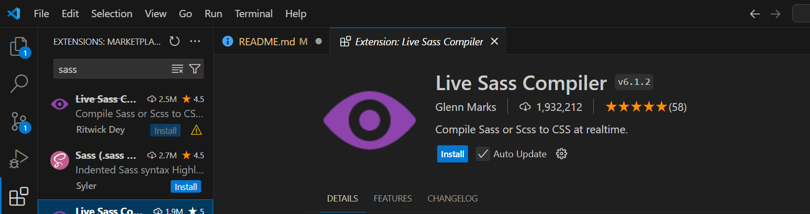
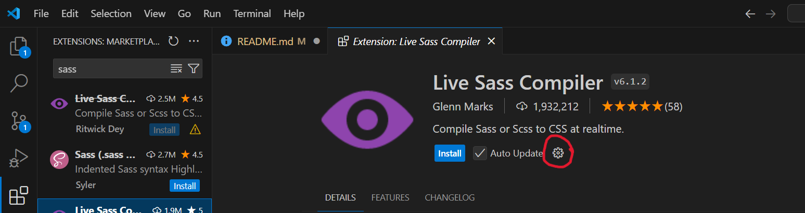

[](https://classroom.github.com/a/5RRbLEkD)
# Introduction à Scss

## Introduction à Scss (30 minutes)

### Qu'est-ce qu'un préprocesseur CSS ?
Un préprocesseur CSS est un langage qui étend les capacités du CSS, permettant d'écrire du code plus maintenable et réutilisable. On écrit le code en syntaxe préprocesseur (comme Scss), puis il est **compilé** en CSS que le navigateur peut interpréter.

#### Pourquoi utiliser un préprocesseur
- **Améliorer la productivité** : Avec des fonctionnalités avancées (variables, mixins, imbrication), le code devient plus efficace.
- **Meilleure organisation du code** : On peut structurer le projet avec des fichiers modulaires (partiels), et éviter la répétition grâce à des mixins et des fonctions.

### Qu'est-ce que Sass
- **Sass** signifie "Syntactically Awesome Style Sheets". C’est un préprocesseur CSS créé en 2006 par Hampton Catlin.
- Il propose deux syntaxes :
  - **Sass (indenté)** : Syntaxe originale basée sur l'indentation, sans accolades ni point-virgules.
  - **Scss (Sassy CSS)** : Syntaxe plus proche du CSS classique, avec accolades et point-virgules.

Syntaxe Sass :
```sass
$main-color: #3498db
body
  background-color: $main-color
  font-family: Arial, sans-serif
```

  Syntaxe Scss :
```scss
$main-color: #3498db;
body {
  background-color: $main-color;
  font-family: Arial, sans-serif;
}
```

### Autres préprocesseurs CSS
- **Less** : Un autre préprocesseur populaire qui fonctionne de manière similaire à Scss, mais avec moins de fonctionnalités avancées.
- **Stylus** : Préprocesseur très flexible, mais moins utilisé que Sass et Less.


### Installation de SCSS


**VSCode**
 Pour utiliser le compilateur sass, les environnements de développement tels que vscode fournissent des plugins. Dans visual studio, installez le plugin `Live Sass Compiler`

 

 Pour spécifier où va se compiler le scss, on peut configurer le plugin avec les valeurs suivantes: 

 ```json
  "liveSassCompile.settings.generateMap": false,
  "liveSassCompile.settings.formats": [
    {
      "format": "expanded",
      "savePath": "/css",
    }
  ]
  ```

Pour accéder au fichier `settings.json`, il faut ouvrir la configuration du plugin et ensuite cliquer sur `Edit in settings.json`




**Ligne de commande**

Il est possible d'installer `sass` en tant que ligne de commande en tant que paquet `Ruby` en suivant ces [instructions](https://sass-lang.com/install/).  On peut ensuite utiliser la commande suivante pour avoir des changements en live:
`sass --watch scss:css`

## Structure du Projet en Scss  

### Organisation du code

Dans un projet CSS classique, tous les styles peuvent être regroupés dans un seul fichier ou répartis de manière plus ou moins aléatoire dans plusieurs fichiers. Cela peut vite devenir compliqué à maintenir.

Avec Scss, on recommande d'utiliser une structure modulaire avec des **partiels**. Les partiels sont des fichiers Scss spécifiques à une fonctionnalité ou une section de la page, puis importés dans un fichier principal.

### Exemple d'arborescence

L'une des forces de Scss réside dans la possibilité de diviser le code en plusieurs fichiers pour mieux organiser les styles. Voici une structure typique :

```
/scss
  ├── _variables.scss
  ├── _mixins.scss
  ├── _reset.scss
  ├── _base.scss
  ├── _layout.scss
  ├── _components.scss
  └── style.scss
/css
  └── style.css
```

- **`_variables.scss`** : Contient toutes les variables (couleurs, tailles, marges, etc.).
- **`_mixins.scss`** : Contient les mixins réutilisables pour des fonctions complexes (ex. media queries, styles répétitifs).
- **`_reset.scss`** : Contient les styles de reset, pour harmoniser l’apparence des éléments HTML par défaut.
- **`_base.scss`** : Contient les styles de base de typographie, des balises HTML communes comme les titres, les paragraphes.
- **`_layout.scss`** : Contient les styles liés à la mise en page générale (grilles, conteneurs, etc.).
- **`_components.scss`** : Contient les styles spécifiques aux composants de l’interface utilisateur (boutons, formulaires, menus, etc.).
- **`style.scss`** : Le fichier principal qui importe tous les autres fichiers partiels.

### Règles de nommage des fichiers Scss
- Les **fichiers partiels** en Scss doivent commencer par un **underscore** (`_`). Cela indique qu'ils ne seront pas compilés directement en fichiers CSS individuels, mais seront inclus dans un fichier Scss principal.
  
Dans le fichier `style.scss`, on peut importer les autres fichiers partiels comme ceci :
```scss
@use 'variables';
@use 'mixins';
@use 'reset';
@use 'base';
@use 'layout';
@use 'components';
```

On peut aussi voir la syntaxe plus ancienne `@import` être utilisée au lieu de `@use`.


## Les Variables
Les variables permettent de stocker des valeurs réutilisables (couleurs, tailles, polices, etc.) et facilitent la maintenance du code.

```scss
$main-color: #3498db;
$font-size: 16px;

body {
  color: $main-color;
  font-size: $font-size;
}
```

- Les variables Scss peuvent être **manipulées** et organisées dans des fichiers partiels.
- Scss permet d'utiliser des **fonctions** pour manipuler les variables (ex. `darken`, `lighten`).
- Organiser les variables dans un fichier dédié (`_variables.scss`).

## Imbrication (Nesting)
L’imbrication en Scss permet d’écrire des sélecteurs imbriqués de manière plus logique, en respectant la structure HTML.

Sans imbrication :
```css
nav {
  background-color: #333;
}
nav ul {
  list-style: none;
}
nav ul li {
  display: inline-block;
}
```

Avec imbrication en Scss :
```scss
nav {
  background-color: #333;
  
  ul {
    list-style: none;
    
    li {
      display: inline-block;
    }
  }
}
```

 Il et conseillé d'Éviter la sur-imbrication. Limiter l’imbrication à 3-4 niveaux pour éviter un code trop complexe et difficile à maintenir.

- **Pseudo-classes** (ex. `:hover`, `:focus`) :
```scss
button {
  background-color: $main-color;
  
  &:hover {
    background-color: darken($main-color, 10%);
  }
}
```
- **Media queries** :
```scss
.container {
  width: 100%;
  
  @media (min-width: 768px) {
    width: 80%;
  }
}
```

---

## Exercice 1

- Convertir le fichier styles.css en scss
- Utiliser des variables pour regrouper les valeurs communes
- Utiliser l'imbrication pour simplifier la structure
- Faire que le fichier soit généré dans `css/styles.css`

## Les partiels

Les **partiels** sont des fichiers Scss modulaires contenant des portions de code CSS réutilisables. Ils permettent de diviser le projet en plusieurs fichiers pour organiser le code de manière plus lisible et maintenable. Un partiel est simplement un fichier Scss qui commence par un **underscore** (`_`), ce qui signifie qu'il ne sera pas compilé directement en un fichier CSS. Il est ensuite **importé** dans un fichier principal.

```scss
// _variables.scss
$primary-color: #3498db;
$font-family: 'Arial, sans-serif';
```

- Ici, le fichier `_variables.scss` contient les variables utilisées dans tout le projet.

### Organisation du projet avec les partiels
L'un des avantages des partiels est qu'ils permettent de séparer le code en fonction de la logique du projet. Cela améliore la lisibilité et facilite la collaboration au sein d'une équipe.

#### Exemples de fichiers partiels courants :
- **`_reset.scss`** : Contient les styles de réinitialisation (reset) du CSS.
- **`_variables.scss`** : Contient les variables globales (couleurs, tailles, polices, etc.).
- **`_mixins.scss`** : Contient les mixins pour réutiliser les blocs de code.
- **`_layout.scss`** : Gère la mise en page (grilles, conteneurs, etc.).
- **`_components.scss`** : Contient les styles pour les composants spécifiques (boutons, formulaires, etc.).


### Utilisation
Les partiels doivent être **importés** dans le fichier principal pour être pris en compte lors de la compilation.

```scss
@import 'variables';
@import 'mixins';
@import 'layout';
@import 'components';
```

> **Remarque importante** : Avec les versions récentes de Sass, on utilise de plus en plus la directive `@use` à la place de `@import`, qui est en train d’être dépréciée.

```scss
@use 'variables';
@use 'mixins';
```

Lorsque vous utilisez `@use`, il faut référencer les variables ou mixins avec leur namespace (par exemple `variables.$primary-color`). Il est possible d'enlever l'espace de noms (namespace) en utilisant: 

```scss
@user 'variables' as *;
```

## Les Mixins

Les **mixins** permettent de réutiliser des blocs de styles dans tout le projet. Ils sont particulièrement utiles pour éviter la duplication de code et pour appliquer des styles qui nécessitent des valeurs dynamiques ou des propriétés CSS complexes comme les **media queries**.

```scss
@mixin border-radius($radius) {
  -webkit-border-radius: $radius;
  -moz-border-radius: $radius;
  border-radius: $radius;
}
```

Ce mixin permet de définir une bordure arrondie compatible avec plusieurs navigateurs.

### Utilisation
Une fois que le mixin est défini, on peut l'**inclure** dans n'importe quel sélecteur avec la directive `@include`.

```scss
.button {
  @include border-radius(10px);
  background-color: $primary-color;
  color: white;
  padding: 10px 20px;
}
```
Le mixin `border-radius` est ici appliqué au bouton avec une valeur de 10px pour le rayon des bordures.

### Les paramètres
Les mixins peuvent accepter des **paramètres** pour personnaliser leur comportement. Cela permet d'éviter de répéter des styles similaires avec des valeurs différentes.

```scss
@mixin box-shadow($x, $y, $blur, $color) {
  -webkit-box-shadow: $x $y $blur $color;
  -moz-box-shadow: $x $y $blur $color;
  box-shadow: $x $y $blur $color;
}

.card {
  @include box-shadow(0px, 2px, 10px, rgba(0, 0, 0, 0.2));
}
```

### Media queries
Les mixins sont particulièrement utiles pour les **media queries**, qui sont souvent répétées dans un projet. En créant un mixin pour gérer les media queries, on peut les réutiliser de manière cohérente dans tout le code.

```scss
@mixin respond-to($breakpoint) {
  @if $breakpoint == 'mobile' {
    @media (max-width: 600px) { @content; }
  }
  @else if $breakpoint == 'tablet' {
    @media (max-width: 768px) { @content; }
  }
}

.container {
  width: 100%;

  @include respond-to('tablet') {
    width: 80%;
  }
  
  @include respond-to('mobile') {
    width: 100%;
  }
}
```

Dans cet exemple, le mixin `respond-to` facilite l'utilisation des media queries pour les différentes tailles d'écrans.

---

## Exercice 2

- Separer le fichier `styles.scss` en plusieurs fichiers
  - `styles.scss` qui importe les mixins et partiels
  - `mixins.scss` avec à l'intérieur un mixin `box-shadow` 
  - `components.scss` avec le style des composants
  - `layout.scss` avec la mise en page générale

## Récapitulatif

- Scss offre une syntaxe plus puissante et flexible que le CSS standard.
- Les variables et l'imbrication sont des fonctionnalités clés qui améliorent la maintenabilité du code.
- La compilation est une étape nécessaire pour transformer le Scss en CSS utilisable par les navigateurs.
- Une bonne organisation du projet Scss peut grandement améliorer l'efficacité du développement.

## Exercice 3 

Cet exercice est à remettre avec github classrooms

- Ajouter un `mixin` pour les media queries qui permette d'avoir un affichage petit et grand.