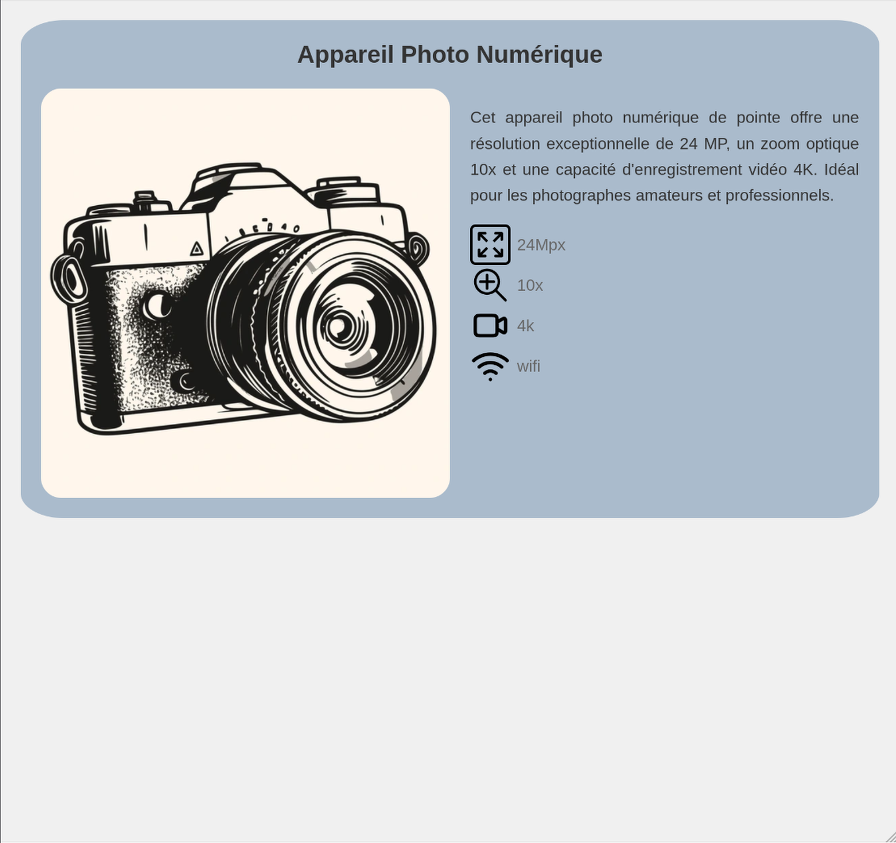
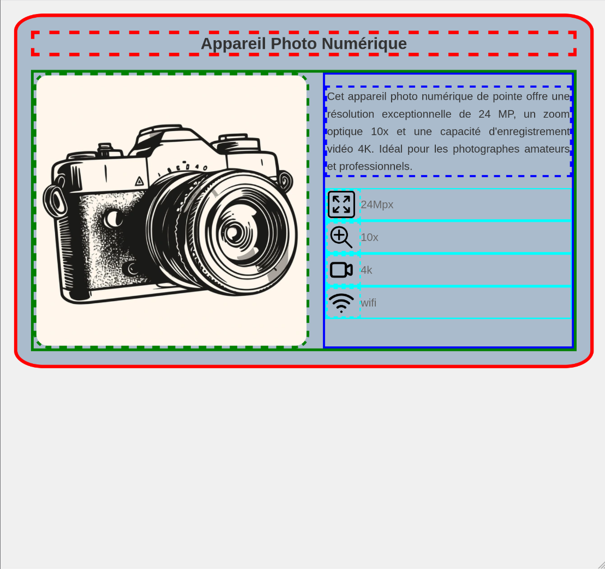
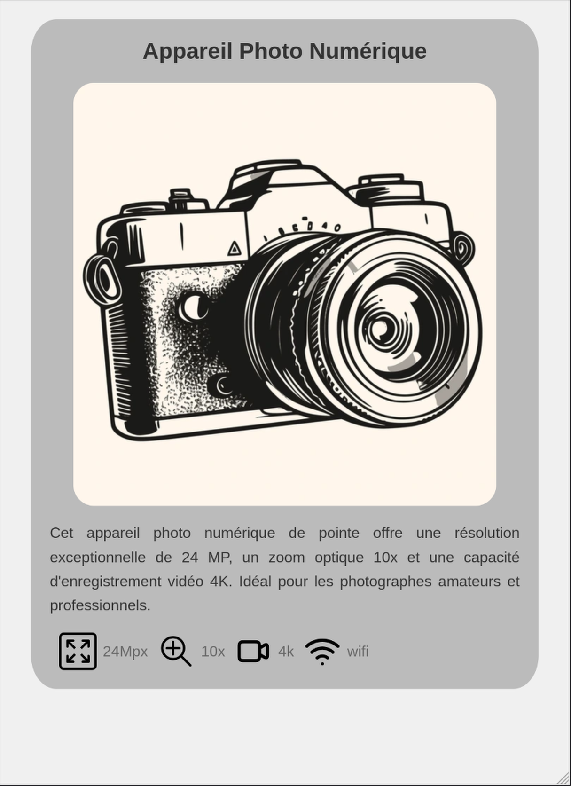
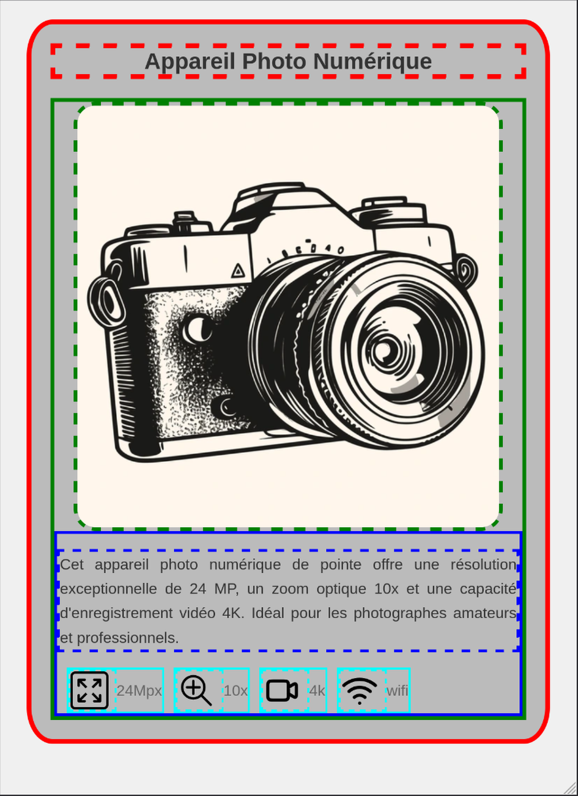

[](https://classroom.github.com/a/9jg25wmP)
# Mise en page avec Flexbox

Flexbox est un module CSS conçu pour faciliter la création de mises en page flexibles et réactives. Il permet de distribuer l'espace et d'aligner le contenu dans un conteneur, même lorsque la taille des éléments est inconnue ou dynamique.

## 1. Flexbox

### Pourquoi utiliser flexbox

- Flexbox simplifie la création de mises en page flexibles
- Les axes principal et secondaire sont fondamentaux
- Le conteneur contrôle la disposition globale
- Les éléments peuvent être finement ajustés avec `flex`

### Concepts de base

Deux concepts fondamentaux à comprendre :
1. Le conteneur flexible : l'élément parent qui reçoit `display: flex`
2. Les éléments flexibles : les enfants directs du conteneur flexible

## 2. Les axes Flexbox 

### Axe principal et axe secondaire

Flexbox fonctionne selon deux axes :
- L'axe principal : défini par la propriété `flex-direction`
- L'axe secondaire : perpendiculaire à l'axe principal

### La propriété flex-direction

`flex-direction` peut prendre quatre valeurs :
- `row` (par défaut) : de gauche à droite
- `row-reverse` : de droite à gauche
- `column` : de haut en bas
- `column-reverse` : de bas en haut


## 3. Conteneur Flexible

### Création d'un conteneur flexible

Pour créer un conteneur flexible, utilisez :
```css
.container {
  display: flex;
}
```

### Flex-wrap et flex-flow

`flex-wrap` contrôle si les éléments flexibles sont forcés sur une seule ligne ou peuvent s'enrouler sur plusieurs lignes :
- `nowrap` (par défaut) : une seule ligne
- `wrap` : plusieurs lignes si nécessaire
- `wrap-reverse` : plusieurs lignes, de bas en haut

`flex-flow` est une propriété raccourcie pour `flex-direction` et `flex-wrap`.

### Alignement avec justify-content et align-items

`justify-content` aligne les éléments le long de l'axe principal :
- `flex-start`, `flex-end`, `center`, `space-between`, `space-around`, `space-evenly`

`align-items` aligne les éléments le long de l'axe secondaire :
- `stretch`, `flex-start`, `flex-end`, `center`, `baseline`


## Exercice: 

On souhaite réaliser des fiches produits pour un site de vente en ligne. Le fichier `index.html` contient tout le code html nécessaire pour réaliser l'exercice, le but est de modifier le fichier `styles.css` et d'ajouter le code permettant d'atteindre le design sur la photo en utilisant les propriétés flex. 





## 4. Éléments Flexibles

### Les propriétés flex-grow, flex-shrink, et flex-basis

- `flex-grow` : facteur de croissance
- `flex-shrink` : facteur de rétrécissement
- `flex-basis` : taille de base de l'élément

### La propriété raccourcie flex

`flex` combine `flex-grow`, `flex-shrink`, et `flex-basis` :
```css
.item {
  flex: 1 1 auto; /* grow shrink basis */
}
```

### Valeurs courantes

- `flex: initial` (0 1 auto)
- `flex: auto` (1 1 auto)
- `flex: none` (0 0 auto)
- `flex: <positive-number>` (ex: flex: 1 ou flex: 2)

## Exercice à remettre

L'exercice est à remettre individuellement avec github classrooms.

Afin de rendre le site de vente adaptatif, réaliser une version pour les écrans plus petits que `768px` correspondant aux images ci dessous: 



